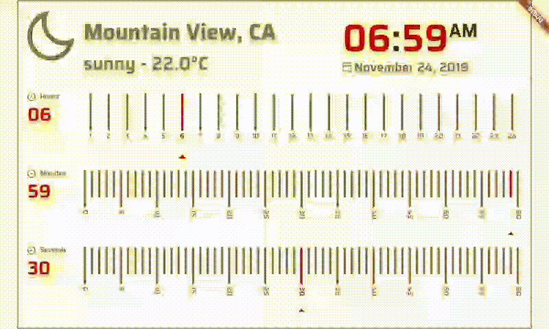
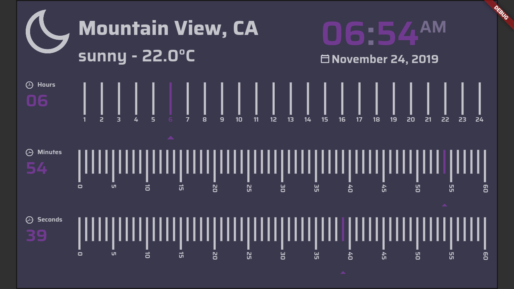
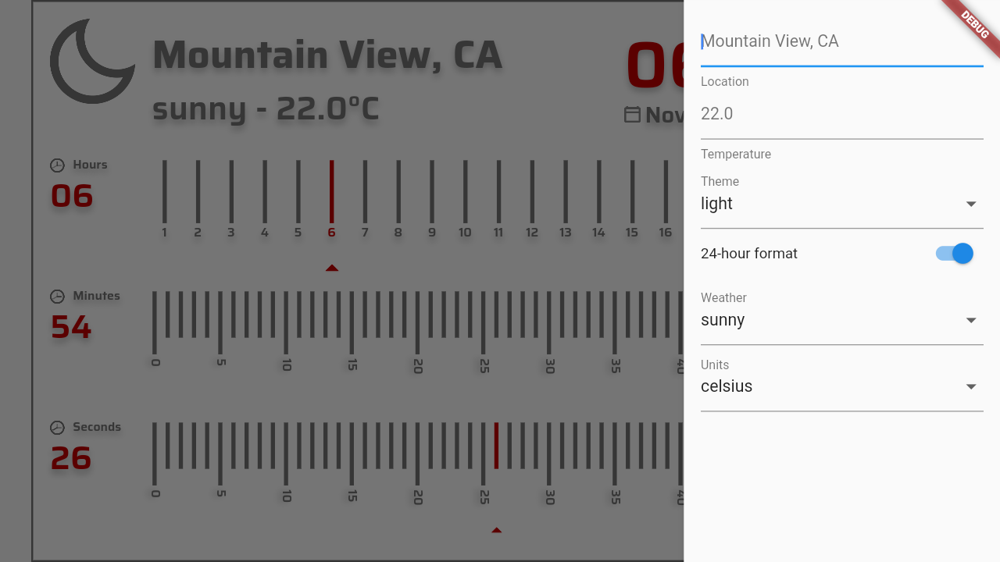

# Elton Clock

This is the elton watch, made for https://flutter.dev/clock
It has a light theme and a dark theme, and displays sample weather and location data.

#run web
flutter run -d chrome
flutter run -d Linux

#build web
flutter build web

Licence: 

https://opensource.org/licenses/BSD-3-Clause
